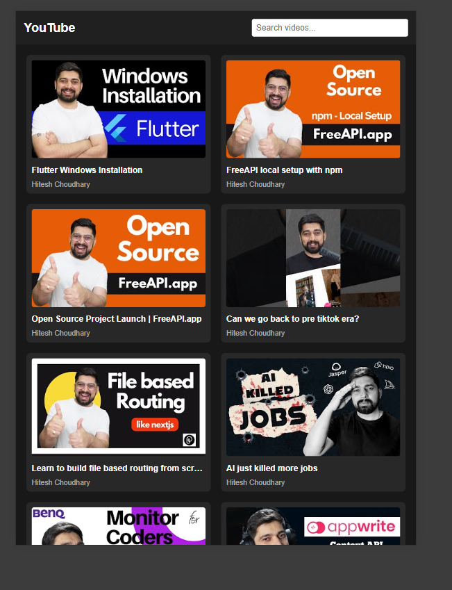
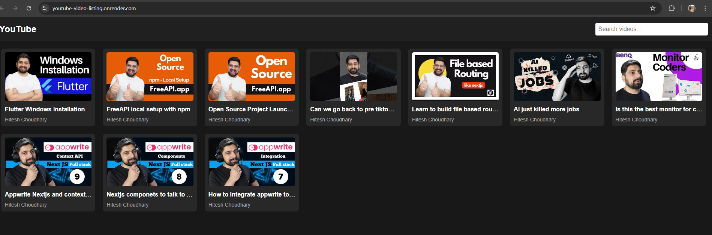
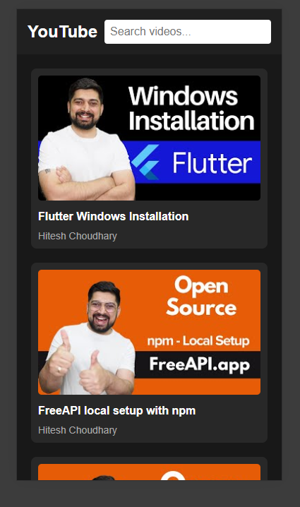
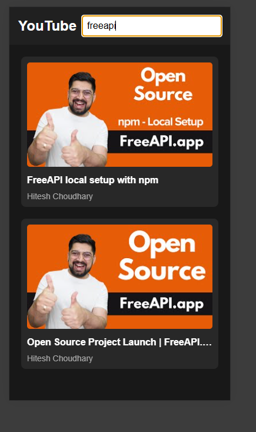

# YouTube Video Listing

## Objective
Build a YouTube-style video listing page that fetches and displays videos from the FreeAPI YouTube endpoint.

## Application features
- Fetch and display a list of YouTube videos.
- Show video thumbnails, titles, and channel names.
- Click on a video to open it in YouTube.
- A search bar to filter videos (filtering only on the frontend without additional API calls).
- A grid layout for better UI.

## Deployment
[Deployment ](https://freeapi.hashnode.space/api-guide/apireference/getYoutubeVideos).

## Screenshots
### Responsive layout



### Searching


## API Endpoint
```
GET https://api.freeapi.app/api/v1/public/youtube/videos
```

## Documentation
For more details on API usage, refer to the [API Guide](https://freeapi.hashnode.space/api-guide/apireference/getYoutubeVideos).